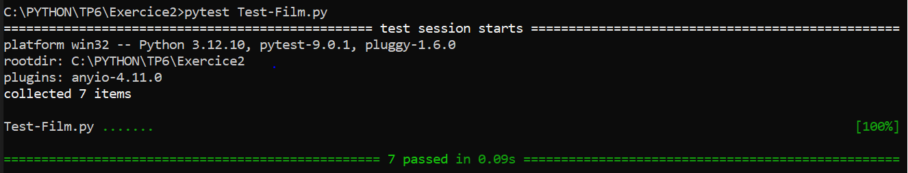
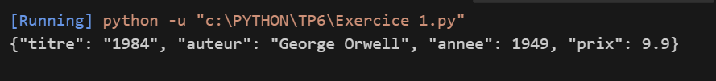

# 🧠 TP6 - Programmation OOP PYTHON 

Ce projet contient les exercices du TP6 en PYTHON .

## 📸 Captures d’écran

Voici les résultats d’exécution :

 Exercice 1:



 Exercice 2 :




---

## ⚙ Compilation
```bash
g++ main.cpp -o main
./main